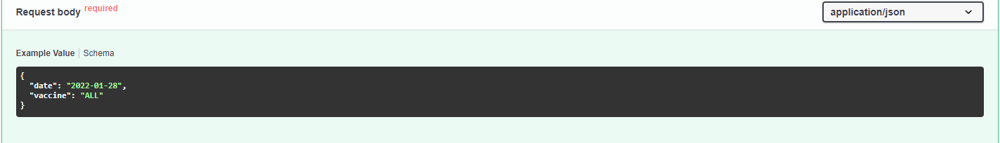

### Day 95-**Custom API Based Website**

- 使用fastapi做一個api的接口

- demo

  

- 使用套件
  - fastapi
  - pandas
  - pydantic
  - requests
  - typing
  - uvicorn 
  
- 資料集來源
  
  - 衛福部疾管署
  
- Run the code
  
  - 在terminal中輸入uvicorn main:app
